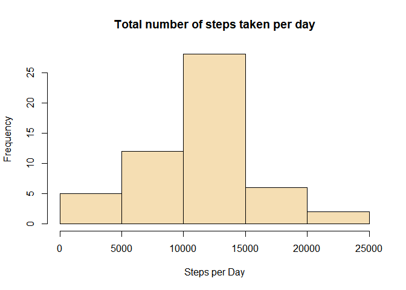
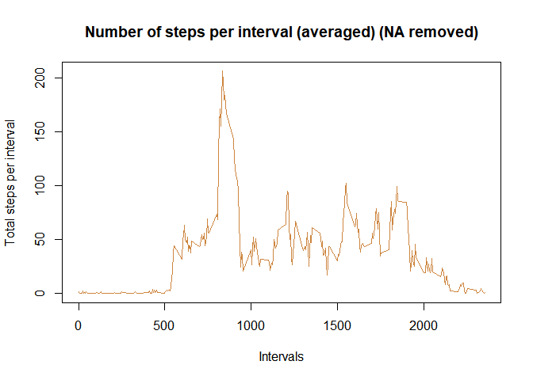
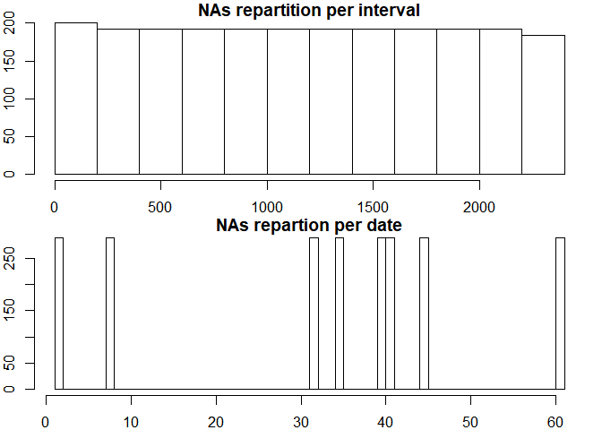
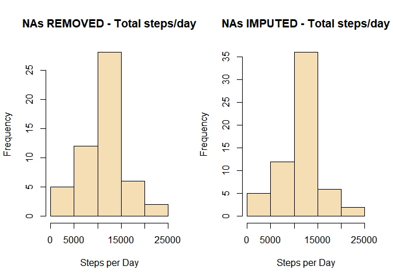
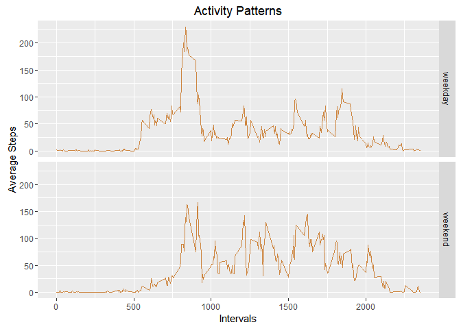

## Loading and preprocessing the data


```r
#Check if the source file is loaded onto the wd of the reader, if not, we download it and unzip the file:
if(!file.exists("activity.csv")) {
        tempfile <- tempfile()
        download.file("http://d396qusza40orc.cloudfront.net/repdata%2Fdata%2Factivity.zip",destfile = tempfile)
        unzip(tempfile)
        unlink(tempfile)
}
```


####1.Load the data (i.e. read.csv())

```r
activity <- read.csv("activity.csv")
```

####2. Process/transform the data (if necessary) into a format suitable for your analysis


```r
summary(activity)
```

```
##      steps                date          interval     
##  Min.   :  0.00   2012-10-01:  288   Min.   :   0.0  
##  1st Qu.:  0.00   2012-10-02:  288   1st Qu.: 588.8  
##  Median :  0.00   2012-10-03:  288   Median :1177.5  
##  Mean   : 37.38   2012-10-04:  288   Mean   :1177.5  
##  3rd Qu.: 12.00   2012-10-05:  288   3rd Qu.:1766.2  
##  Max.   :806.00   2012-10-06:  288   Max.   :2355.0  
##  NA's   :2304     (Other)   :15840
```

```r
str(activity)
```

```
## 'data.frame':	17568 obs. of  3 variables:
##  $ steps   : int  NA NA NA NA NA NA NA NA NA NA ...
##  $ date    : Factor w/ 61 levels "2012-10-01","2012-10-02",..: 1 1 1 1 1 1 1 1 1 1 ...
##  $ interval: int  0 5 10 15 20 25 30 35 40 45 ...
```


## What is mean total number of steps taken per day?

### For this part , ignore the missing values in the dataset(using na.rm = true).

####1. Calculate the total number of steps taken per day

```r
activity_steps_day <- aggregate(steps ~ date, data = activity, FUN = sum, na.rm = TRUE)
```

####2. Histogram of the total number of steps taken each day


```r
hist(activity_steps_day$steps, xlab = "Steps per Day", main = "Total number of steps taken per day", col = "wheat")
```

<!-- -->

####3. Mean and median of the total number of steps taken per day


```r
mean_steps <- mean(activity_steps_day$steps)
median_steps <- median(activity_steps_day$steps)

#Set a normal number format to display the results
mean_steps <- format(mean_steps,digits=1)
median_steps <- format(median_steps,digits=1)
```

#### Mean steps per day: **10766**
#### Median steps per day: **10765**

## What is the average daily activity pattern?

####1. Time series plot (i.e. type = "l") of the 5-minute interval (x-axis) and the average number of steps taken, averaged across all days (y-axis)


```r
#Aggregate function for mean over all days, for each interval
activity_steps_mean <- aggregate(steps ~ interval, data = activity, FUN = mean, na.rm = TRUE)
#Plot
plot(activity_steps_mean$interval, activity_steps_mean$steps, type = "l", col = "tan3", xlab = "Intervals", ylab = "Total steps per interval", main = "Number of steps per interval (averaged) (NA removed)")
```

<!-- -->

####2. Which 5-minute interval, on average across all the days in the dataset, contains the maximum number of steps?


```r
# Highest steps value(maximum of steps on one given interval)
max_steps <-max(activity_steps_mean$steps)

# Interval for which the numbers of steps per interval at the highest
max_interval <- activity_steps_mean$interval[which(activity_steps_mean$steps == max_steps)]
max_steps <- round(max_steps, digits = 2)
```

#### The highest number of steps for a 5 minutes interval : **206.17**
#### which corresponds to interval: **835**

## Imputing missing values

### Note: there are a number of days/intervals where there are missing values (coded as NA). The presence of missing days may introduce bias into some calculations or summaries of the data.

####1. Calculate and report the total number of missing values in the dataset (i.e. the total number of rows with NAs)


```r
sum(is.na(activity))
```

```
## [1] 2304
```

####2. Devise a strategy for filling in all of the missing values in the dataset. The strategy does not need to be sophisticated. For example, you could use the mean/median for that day, or the mean for that 5-minute interval, etc.


```r
#subset general dataset with missing values only
missing_values <- subset(activity, is.na(steps))

#plot repartition, by date or by intervals
par(mfrow = c(2,1), mar = c(2, 2, 1, 1))
hist(missing_values$interval, main="NAs repartition per interval")
hist(as.numeric(missing_values$date), main = "NAs repartion per date", breaks = 61)
```

<!-- -->

####3. Create a new dataset that is equal to the original dataset but with the missing data filled in.


```r
# calculate mean of steps per interval, we end up with a mean for all 288 intervals
MeanStepsPerInterval <- tapply(activity$steps, activity$interval, mean, na.rm = TRUE)

# cut the 'activity' dataset in 2 parts (with and without NAs)
activity_NAs <- activity[is.na(activity$steps),]
activity_non_NAs <- activity[!is.na(activity$steps),]

#replace missing values in activity_NAs
activity_NAs$steps <- as.factor(activity_NAs$interval)
levels(activity_NAs$steps) <- MeanStepsPerInterval

#change the vector back as integer 
levels(activity_NAs$steps) <- round(as.numeric(levels(activity_NAs$steps)))
activity_NAs$steps <- as.integer(as.vector(activity_NAs$steps))

#merge the two datasets together
imputed_activity <- rbind(activity_NAs, activity_non_NAs)
```

###4. Make a histogram of the total number of steps taken each day and Calculate and report the mean and median total number of steps taken per day. Do these values differ from the estimates from the first part of the assignment? What is the impact of imputing missing data on the estimates of the total daily number of steps?


```r
#Plotting parameters to place previous histogram and new one next to each other to draw comparison
par(mfrow = c(1,2))

#Plot again the histogram from the first part of the assignment
activity_steps_day <- aggregate(steps ~ date, data = activity, FUN = sum, na.rm = TRUE)
hist(activity_steps_day$steps, xlab = "Steps per Day", main = "NAs REMOVED - Total steps/day", col = "wheat")

#Plot new histogram, with imputed missing values
imp_activity_steps_day <- aggregate(steps ~ date, data = imputed_activity, FUN = sum, na.rm = TRUE)
hist(imp_activity_steps_day$steps, xlab = "Steps per Day", main = "NAs IMPUTED - Total steps/day", col = "wheat")
```

<!-- -->

Comparison


```r
imp_mean_steps <- mean(imp_activity_steps_day$steps)
imp_median_steps <- median(imp_activity_steps_day$steps)

#Set a normal number format to display the results
imp_mean_steps <- format(imp_mean_steps,digits=1)
imp_median_steps <- format(imp_median_steps,digits=1)

#store the results in a dataframe
results_mean_median <- data.frame(c(mean_steps, median_steps), c(imp_mean_steps, imp_median_steps))
colnames(results_mean_median) <- c("NA removed", "Imputed NA values")
rownames(results_mean_median) <- c("mean", "median")

results_mean_median
```

```
##        NA removed Imputed NA values
## mean        10766             10766
## median      10765             10762
```

## Are there differences in activity patterns between weekdays and weekends?

### For this part the weekdays() function may be of some help here. Use the dataset with the filled-in missing values for this part.

#### 1. Create a new factor variable in the dataset with two levels - "weekday" and "weekend" indicating whether a given date is a weekday or weekend day.


```r
#elseif function to categorize Saturday and Sunday as factor level "weekend", all the rest as "weekday"

imputed_activity$dayType <- ifelse(weekdays(as.Date(imputed_activity$date)) == "Saturday" | weekdays(as.Date(imputed_activity$date)) == "Sunday", "weekend", "weekday")

#transform dayType variable into factor
imputed_activity$dayType <- factor(imputed_activity$dayType)
```

####2. Make a panel plot containing a time series plot (i.e. type = "l") of the 5-minute interval (x-axis) and the average number of steps taken, averaged across all weekday days or weekend days (y-axis). See the README file in the GitHub repository to see an example of what this plot should look like using simulated data.


```r
#Aggregate a table showing mean steps for all intervals, acrlss week days and weekend days
steps_interval_dayType <- aggregate(steps ~ interval + dayType, data = imputed_activity, FUN = mean)

#verify new dataframe 
head(steps_interval_dayType)
```

```
##   interval dayType      steps
## 1        0 weekday 2.28888889
## 2        5 weekday 0.40000000
## 3       10 weekday 0.15555556
## 4       15 weekday 0.17777778
## 5       20 weekday 0.08888889
## 6       25 weekday 1.57777778
```


```r
#add descriptive variables
names(steps_interval_dayType) <- c("interval", "day_type", "mean_steps")

#Install the ggplot2 if it does not exist

#install.packages("ggplot2")

#plot with ggplot2

library(ggplot2)

plot <- ggplot(steps_interval_dayType, aes(interval, mean_steps))
plot + geom_line(color = "tan3") + facet_grid(day_type~.) + labs(x = "Intervals", y = "Average Steps", title = "Activity Patterns")
```

<!-- -->
